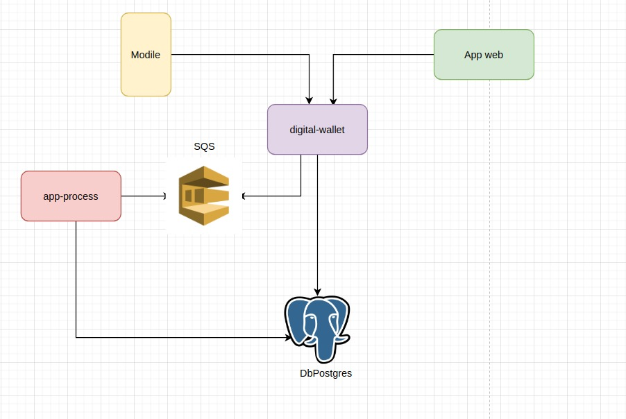
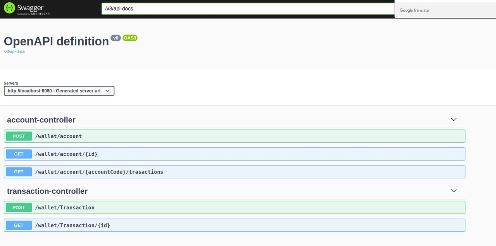

# Digital-wallet

Este projeto se trata de uma carteira digital que seu principal objetivo
é armazenar as transações realizadas pelos clientes.

###O que precisa para rodar:
* java 11
* lombok
* maven
* Docker 20.10.10
* Docker-Compose 1.21.2

####Baixar codigo fonte:
```
    $ git clone https://github.com/ricardodquirino/digital-wallet.git
```
####Subir o banco local:
* Executar o comando abaixo na raiz do projeto
```
    $  docker-compose up postgres-wallet
```
* Após subir a aplicação basta acessar o link para ter acesso ao swagger  


http://localhost:8080/swagger-ui/index.html?configUrl=/v3/api-docs/swagger-config#/

#### Diagrama relacional das tabelas:
https://drive.google.com/file/d/1zk6qWY4bErgD_F6Dj1XB7FMQheGpUh8b/view?usp=sharing

#### Arquitetura de intregração dos microsserviços:


#### Swagger:

